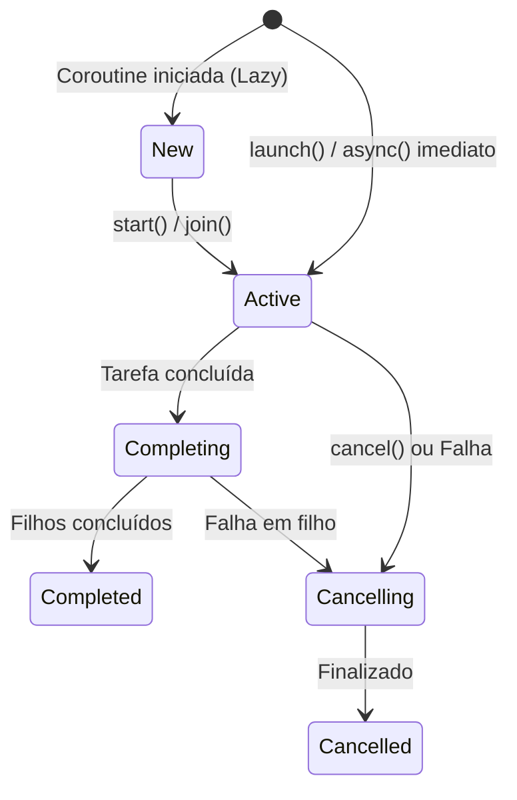

O funcionamento das corrotinas baseia-se na transformação de funções suspensíveis em uma máquina de estados eficiente que permite que uma tarefa pare sua execução sem bloquear a thread atual.

### 1. Ciclo de Vida do Job (Estados Externos)

Sempre que uma corrotina é iniciada (via `launch` ou `async`), ela é representada por um objeto **Job**. Este Job passa por diversos estados desde sua criação até a finalização ou cancelamento.

Estados e Transições de um Job

Abaixo está o diagrama do ciclo de vida de um Job:
- **New (Novo):** A corrotina foi criada (geralmente com `CoroutineStart.LAZY`), mas ainda não foi iniciada.
- **Active (Ativo):** O estado padrão quando uma corrotina é lançada. Ela está executando sua tarefa.
- **Completing (Completando):** A tarefa principal da corrotina terminou, mas ela está aguardando a conclusão de seus filhos (corrotinas lançadas dentro dela).
- **Completed (Completado):** A corrotina e todos os seus filhos terminaram com sucesso.
- **Cancelling (Cancelando):** O cancelamento foi solicitado (via `job.cancel()`) ou ocorreu uma falha, e a corrotina está no processo de limpeza.
- **Cancelled (Cancelado):** A corrotina foi finalizada devido a cancelamento ou erro.



Propriedades de Estado

O status do Job pode ser verificado através de três propriedades principais:

- **isActive**: `true` nos estados _Active_ e _Completing_.
- **isCompleted**: `true` quando a corrotina chega em _Completed_ ou _Cancelled_.
- **isCancelled**: `true` se a corrotina começou a ser cancelada ou já foi finalizada como cancelada.

### Exemplos:

#### Parte A: Monitorando estados do Job

```kotlin
fun main() = runBlocking {
    // 1. Criando uma corrotina no estado 'New' usando início LAZY
    val job = launch(start = CoroutineStart.LAZY) {
        println("   [Execução] Corrotina em execução...")
        delay(500)
    }

    println("Estado inicial: New | isActive: ${job.isActive}, isCompleted: ${job.isCompleted}")

    // 2. Transição para 'Active'
    job.start()
    println("Após start(): Active | isActive: ${job.isActive}")

    // Aguarda a conclusão
    job.join()
    
    // 3. Transição para 'Completed'
    println("Após conclusão: Completed | isCompleted: ${job.isCompleted}")
}
```

